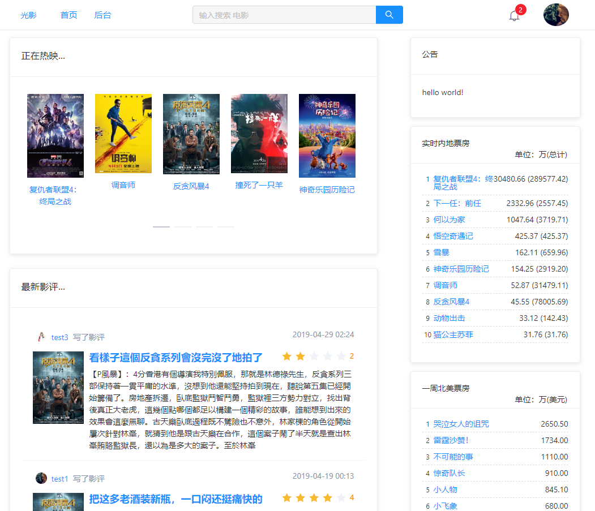
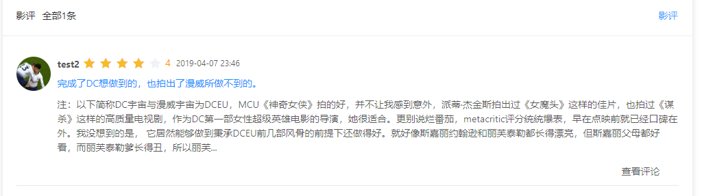
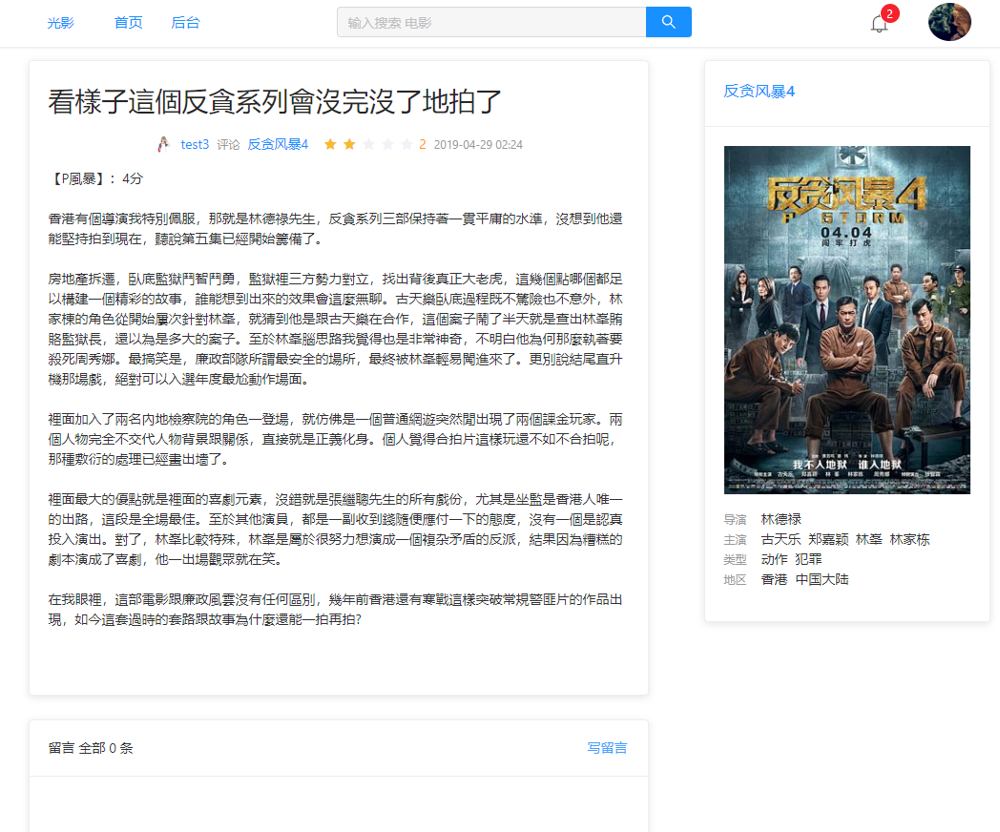
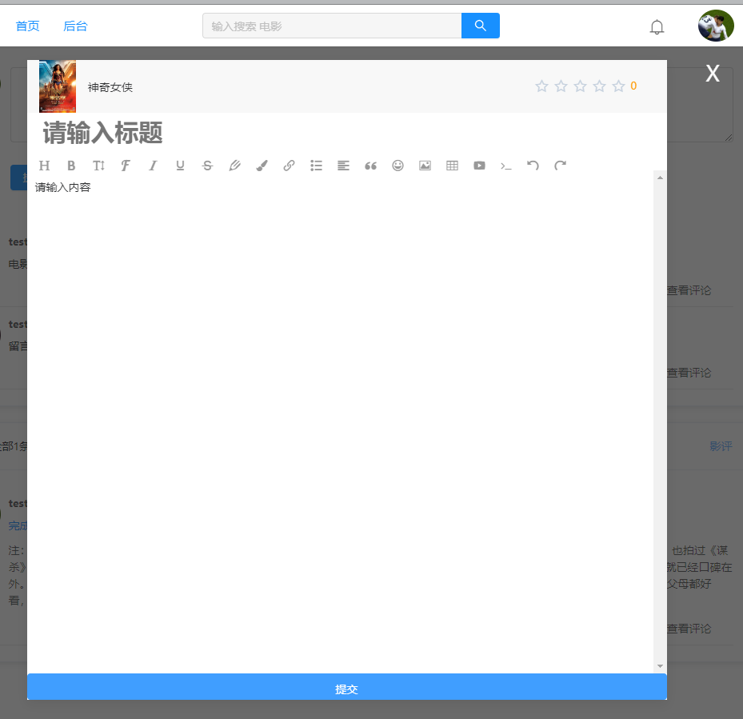
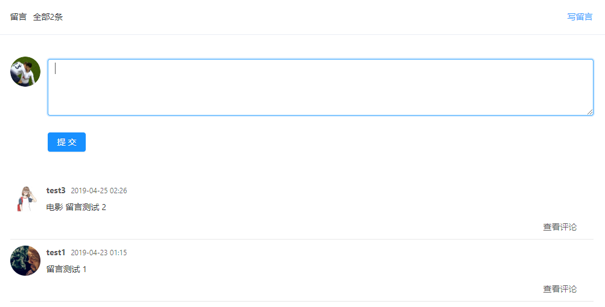
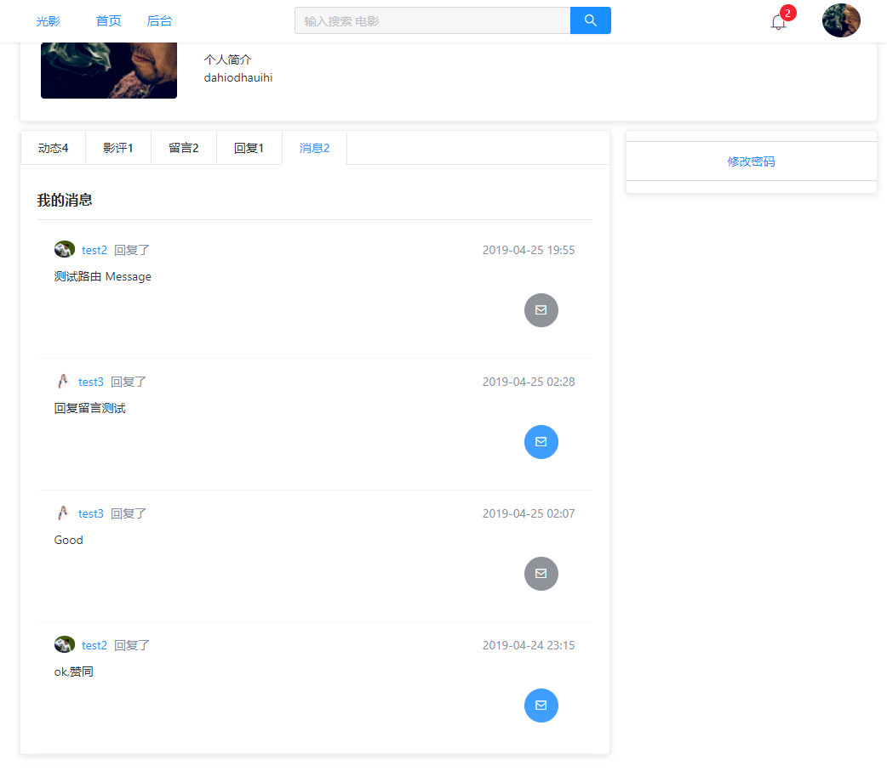
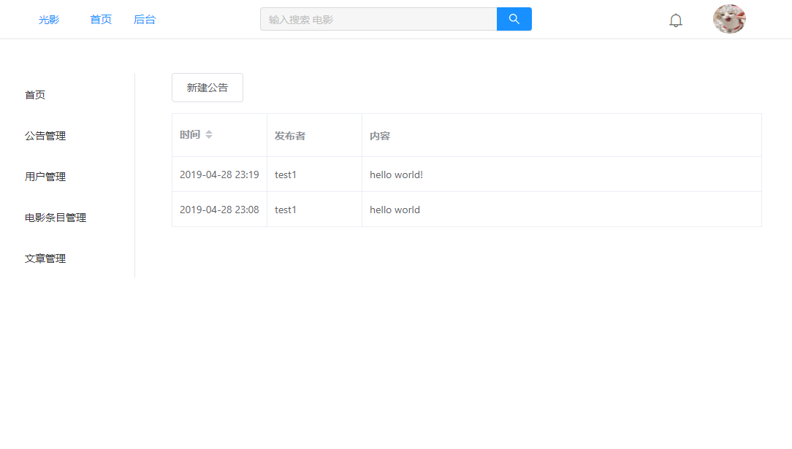
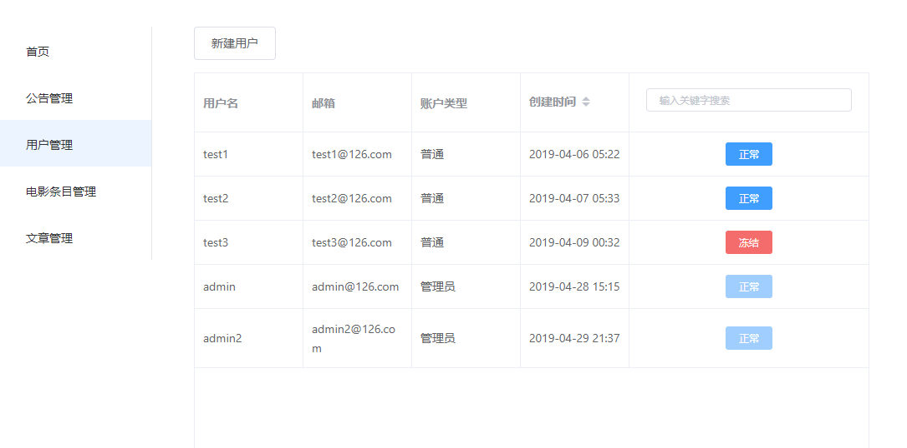
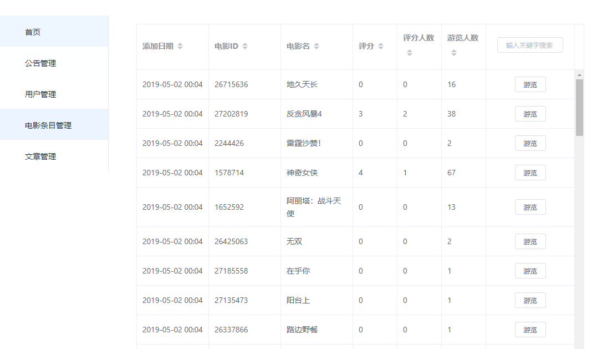
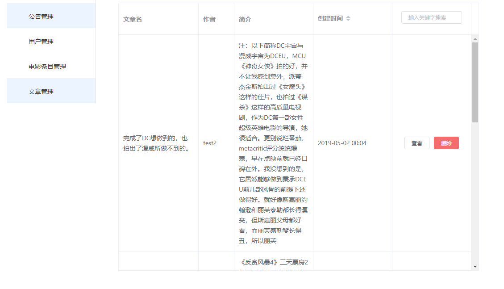

# graduation-project
毕业设计，借用豆瓣API的影迷社区网站(仿豆瓣)
## 技术栈
Vue全家桶+Express+MongoDB
## 使用
本系统前后端分离开发模式，服务器端采用Node.js技术，使用Express框架，编写接口<br>
Multer用于文件上传，Bcrypt用于密码加密，JsonWebToken用于封装Token，Passport-Jwt、Passport验证Token
Node-Schedule用于定时任务，Request请求第三方网站数据；<br>
前端采用MVVM开发模式，使用WebPage构建工具，Vue作为前端框架，Vue-Router用于路由跳转，Vuex状态管理，Axios拦截请求，Wangeditor富文本编辑器借用Elemen、Ant Design组件库，采用封装组件的方式实现页面；<br>
数据库采用MongoDB，使用Mongoose操作。
## 功能描述
本设计主要实现以下模块：
1. 影讯与影评模块：首页展出最近院线电影，最新影评，票房信息，公告等板块；电影详情页展示其全部信息，内容项比如“导演”、“演员”；影评文章页展示用户写的文章。
2. 社交模块：用户可以在电影详情页与影评文章页发表评论（个别可评分）、互相交流；用户拥有自己的个人主页，展示动态、文章，留言；设消息提醒未读消息。
3. 用户管理模块：设立管理员与用户区分账户，并在前端和后端进行判断管理员账号可进入后台管理社区；管理员用户可禁用、解禁普通用户。
4. 信息维护模块；查询、发布公告；查询、管理电影条目；查询、管理影评文章。 
## 开发
``` shell
$ npm install
$ npm client-install
$ npm run server
$ cd client
$ npm run serve
```
## 实例账户
[线上地址](http://bestjianyu.xin) (未优化打包 首次加载较慢)<br>
普通用户：test3@126.com 密码：123<br>
管理员用户: admin@126.com 密码：123

## 示例截图
<div>
  
  
  
  
  
  
  
  
  
  
  
  
</div>

